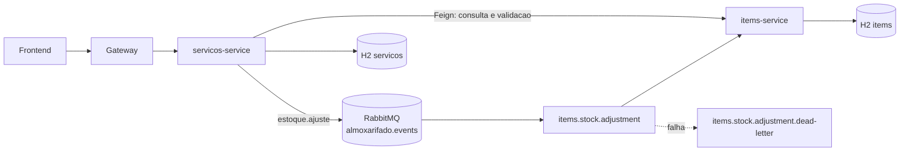
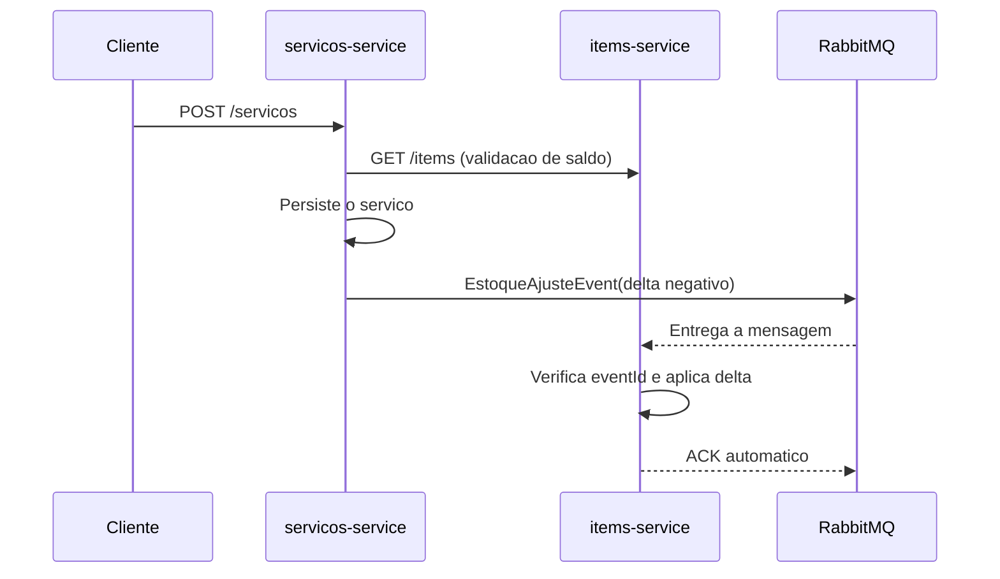

# Almoxarifado com arquitetura orientada a eventos

## Visao geral

O modulo `almoxarifado_servicos` continua responsavel pelo cadastro do servico,
mas nao atualiza mais o estoque por HTTP. Depois de persistir o servico, ele
publica um evento `EstoqueAjusteEvent` no RabbitMQ. O modulo
`almoxarifado_items` consome o evento e aplica o delta de quantidade em sua
propria transacao.



## Fluxo de eventos



Para uma atualizacao, o produtor publica a diferenca entre a quantidade antiga
e a nova: remover itens libera estoque; aumentar quantidades consome estoque.
Cada mensagem possui `eventId`. O consumidor grava esse identificador em
`processed_events` na mesma transacao da alteracao do item, evitando dupla
movimentacao em redeliveries.

## Executar

1. Suba o broker: `docker compose up -d`.
2. Inicie `almoxarifado_items` e `almoxarifado_servicos` pelos comandos Maven
   existentes ou pela IDE.
3. Acesse o painel do RabbitMQ em `http://localhost:15672` com
   `almoxarifado` / `almoxarifado`.

As propriedades `RABBITMQ_HOST`, `RABBITMQ_PORT`, `RABBITMQ_USERNAME` e
`RABBITMQ_PASSWORD` podem substituir os valores locais padrao.

O servico `servicos` valida os itens por Feign diretamente em
`ALMOXARIFADO_ITEMS_URL`. No Docker Compose e no Kubernetes, o valor e
`http://items:8081`, resolvido pelo DNS interno da rede/cluster. Ao executar
pela IDE, o cliente usa `http://localhost:8081` como valor padrao.

## Decisoes arquiteturais

### Vantagens

- Menor acoplamento: servicos nao precisam conhecer a API de escrita de itens.
- Resiliencia: o broker absorve indisponibilidade temporaria do consumidor.
- Escala independente: consumidores podem ser replicados para a mesma fila.
- Rastreabilidade: eventos e dead-letter queues tornam falhas observaveis.
- Consistencia eventual adequada para a atualizacao de estoque apos o cadastro.

### Custos e limites

- A resposta HTTP confirma a gravacao do servico antes do ajuste ser consumido.
- Eventos exigem idempotencia, observabilidade, retentativas e monitoramento.
- O sistema passa a ter consistencia eventual, nao uma transacao ACID entre
  dois bancos.
- RabbitMQ passa a ser uma dependencia operacional adicional.
- A validacao inicial ainda consulta itens por Feign; ela evita aceitar saldo
  obviamente insuficiente, mas concorrencia exige uma politica de reserva mais
  forte se o dominio precisar de garantia absoluta.

### Proximo passo recomendado

Para eliminar a janela entre o commit do servico e a publicacao, substituir o
envio direto pelo padrao **Transactional Outbox**: gravar o evento em uma
tabela local na mesma transacao e usar um relay para publica-lo no RabbitMQ.

# TP5 - Operacao, conteinerizacao, monitoramento e testes

## Objetivo

Esta etapa prepara os microsservicos para execucao reproduzivel em Docker e
Kubernetes, com health checks, metricas Prometheus, pipeline automatizado e
testes executados a cada alteracao.

## Estrutura operacional

Cada modulo Java possui um `Dockerfile` multi-stage: a primeira imagem compila
com Maven e Java 21 e a imagem final executa somente o JRE. Os artefatos sao:

- `almoxarifado_server`: Config Server e Eureka em `8888`.
- `almoxarifado_gateway`: API Gateway em `8080`.
- `almoxarifado_items`: estoque e consumidor RabbitMQ em `8081`.
- `almoxarifado_servicos`: servicos e produtor RabbitMQ em `8082`.
- `rabbitmq`: broker AMQP em `5672` e painel em `15672`.

O Compose sobe a topologia completa:

```bash
docker compose up -d --build
docker compose ps
docker compose logs -f servicos
```

O frontend fica disponivel em `http://localhost:3000` e acessa o gateway em
`http://localhost:8080`. A imagem do frontend compila os arquivos estaticos
com Vite e os serve com Node.js usando o pacote `serve`.

`VITE_GATEWAY_URL` e gravada nos arquivos estaticos durante o build, nao e
lida em tempo de execucao. Ao alternar entre Compose e Kubernetes, reconstrua
a imagem do frontend com a URL do gateway do ambiente de destino. No Compose,
o argumento ja esta definido no `docker-compose.yml`; para reconstruir e
atualizar somente o frontend, execute:

```bash
docker compose build --no-cache frontend
docker compose up -d --no-deps frontend
```

Para parar os containers sem remover os dados do RabbitMQ:

```bash
docker compose down
```

## Kubernetes

Os manifests em `k8s/` incluem Namespace, Secret de credenciais, ConfigMap de
runtime, Deployments e Services dos microsservicos, frontend, RabbitMQ e
Prometheus. As imagens dos microsservicos e do frontend usam as tags
`almoxarifado-{server,gateway,items,servicos,frontend}:latest`.

```bash
kubectl apply -k k8s/
kubectl -n almoxarifado get pods,svc
kubectl -n almoxarifado port-forward svc/gateway 30080:8080
kubectl -n almoxarifado port-forward svc/frontend 30081:80
kubectl -n almoxarifado port-forward svc/prometheus 9090:9090
```

Com os port-forwards ativos, acesse o frontend em `http://localhost:30081`;
ele usa o gateway em `http://localhost:30080`. Os Services tambem expoem essas
portas como NodePorts. No kind, o acesso pelo host pode exigir `extraPortMappings`
na criacao do cluster; os comandos `port-forward` acima funcionam sem essa
configuracao.

Para usar as imagens locais no kind, construa-as com Docker e carregue-as no
cluster (o exemplo considera um cluster chamado `kind`) antes de aplicar os
manifests:

```bash
docker build -t almoxarifado-items:latest ./almoxarifado_items
docker build -t almoxarifado-servicos:latest ./almoxarifado_servicos
docker build -t almoxarifado-gateway:latest ./almoxarifado_gateway
docker build -t almoxarifado-server:latest ./almoxarifado_server
docker build --build-arg VITE_GATEWAY_URL=http://localhost:30080 -t almoxarifado-frontend:latest ./almoxarifado_frontend
kubectl apply -k k8s/
```

O build acima grava `http://localhost:30080` no frontend para o acesso ao
gateway pelo `port-forward`. Se o frontend ja estiver implantado, disponibilize
a imagem reconstruida no runtime usado pelos nos do cluster antes de reiniciar
o Deployment (os manifests usam `imagePullPolicy: Never`):

```bash
kubectl -n almoxarifado rollout restart deployment/frontend
kubectl -n almoxarifado rollout status deployment/frontend
```

Ao voltar para Compose, reconstrua o frontend novamente; a imagem Kubernetes
usa uma URL de gateway diferente da imagem Compose.

Os bancos ainda usam H2 em memoria, adequado para demonstracao e testes. Para
producao, substituir H2 por bancos gerenciados e fornecer URLs por Secret,
alem de usar PVC para qualquer estado que precise sobreviver a reinicios.

## Monitoramento

Os quatro servicos expoem:

- `/actuator/health`: estado agregado.
- `/actuator/health/liveness`: processo vivo.
- `/actuator/health/readiness`: pronto para receber trafego.
- `/actuator/prometheus`: metricas para scraping.

O Prometheus configurado em `k8s/monitoring.yaml` coleta as quatro APIs a cada
15 segundos. O RabbitMQ possui probes TCP e os microsservicos possuem probes
HTTP de liveness/readiness. Em producao, restringir o acesso aos endpoints
Actuator por rede ou gateway de observabilidade e adicionar alertas para
falhas de readiness, aumento de latencia, erros HTTP e mensagens na DLQ.

## Configuracao e versionamento

Configuracoes que variam por ambiente devem ser fornecidas por variaveis de
ambiente ou Secrets, nunca commitadas como credenciais. Os nomes suportados
incluem `RABBITMQ_HOST`, `RABBITMQ_PORT`, `RABBITMQ_USERNAME`,
`RABBITMQ_PASSWORD`, `EUREKA_CLIENT_SERVICEURL_DEFAULTZONE` e
`ALMOXARIFADO_ITEMS_URL`.

CORS e configurado no gateway para as chamadas feitas pelo navegador pelo
frontend (Vite em `http://localhost:5173`, Compose em `http://localhost:3000`
ou Kubernetes via port-forward em `http://localhost:30081`). A chamada Feign
de `servicos` para `items` e entre servidores e nao depende de CORS. Se o
frontend for acessado por outro host ou porta, inclua essa origem na
configuracao CORS do gateway.

O Compose usa defaults locais; Kubernetes centraliza valores nao sensiveis em
`k8s/config.yaml` e credenciais em `k8s/config.yaml` como Secret. Em um cluster
real, substituir o Secret versionado por External Secrets, Sealed Secrets ou
o gerenciador de secrets da plataforma.

## CI e testes

O workflow `.github/workflows/ci.yml` executa em cada Pull Request e push:

1. Configura Java 21 e cache Maven.
2. Executa `mvnw test` em cada microsservico.
3. Executa o empacotamento sem repetir os testes.

Para reproduzir localmente:

```powershell
.\almoxarifado_items\mvnw.cmd test
.\almoxarifado_servicos\mvnw.cmd test
.\almoxarifado_gateway\mvnw.cmd test
.\almoxarifado_server\mvnw.cmd test
```