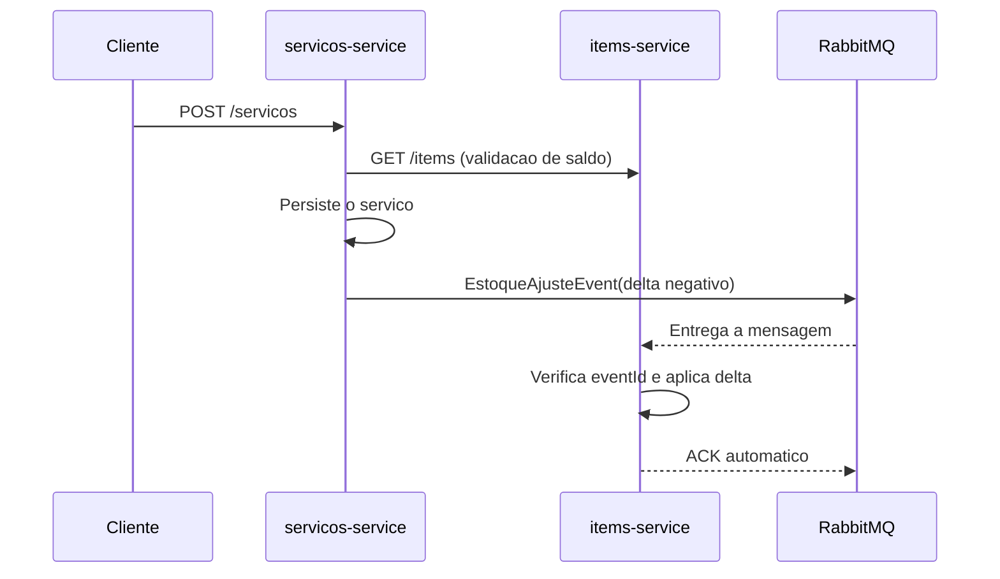

# Almoxarifado com arquitetura orientada a eventos

## Visao geral

O modulo `almoxarifado_servicos` continua responsavel pelo cadastro do servico,
mas nao atualiza mais o estoque por HTTP. Depois de persistir o servico, ele
publica um evento `EstoqueAjusteEvent` no RabbitMQ. O modulo
`almoxarifado_items` consome o evento e aplica o delta de quantidade em sua
propria transacao.

## Fluxo de eventos

Para uma atualizacao, o produtor publica a diferenca entre a quantidade antiga
e a nova: remover itens libera estoque; aumentar quantidades consome estoque.
Cada mensagem possui `eventId`. O consumidor grava esse identificador em
`processed_events` na mesma transacao da alteracao do item, evitando dupla
movimentacao em redeliveries.

## Executar

1. Suba o broker: `docker compose up -d`.
2. Inicie `almoxarifado_items` e `almoxarifado_servicos` pelos comandos Maven
   existentes ou pela IDE.
3. Acesse o painel do RabbitMQ em `http://localhost:15672` com
   `almoxarifado` / `almoxarifado`.

As propriedades `RABBITMQ_HOST`, `RABBITMQ_PORT`, `RABBITMQ_USERNAME` e
`RABBITMQ_PASSWORD` podem substituir os valores locais padrao.

## Decisoes arquiteturais

### Vantagens

- Menor acoplamento: servicos nao precisam conhecer a API de escrita de itens.
- Resiliencia: o broker absorve indisponibilidade temporaria do consumidor.
- Escala independente: consumidores podem ser replicados para a mesma fila.
- Rastreabilidade: eventos e dead-letter queues tornam falhas observaveis.
- Consistencia eventual adequada para a atualizacao de estoque apos o cadastro.

### Custos e limites

- A resposta HTTP confirma a gravacao do servico antes do ajuste ser consumido.
- Eventos exigem idempotencia, observabilidade, retentativas e monitoramento.
- O sistema passa a ter consistencia eventual, nao uma transacao ACID entre
  dois bancos.
- RabbitMQ passa a ser uma dependencia operacional adicional.
- A validacao inicial ainda consulta itens por Feign; ela evita aceitar saldo
  obviamente insuficiente, mas concorrencia exige uma politica de reserva mais
  forte se o dominio precisar de garantia absoluta.

### Proximo passo recomendado

Para eliminar a janela entre o commit do servico e a publicacao, substituir o
envio direto pelo padrao **Transactional Outbox**: gravar o evento em uma
tabela local na mesma transacao e usar um relay para publica-lo no RabbitMQ.